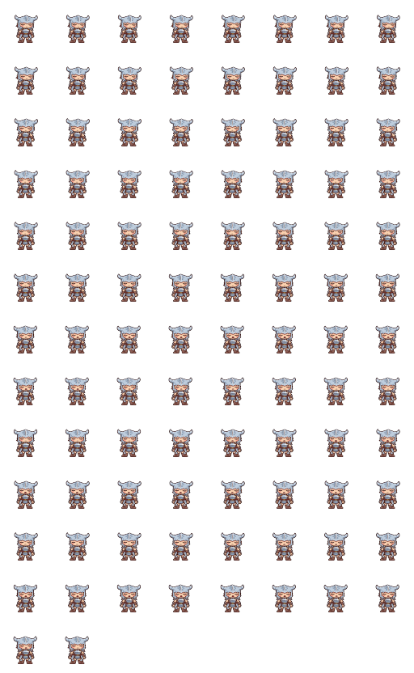
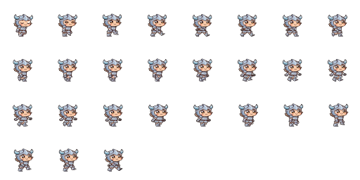
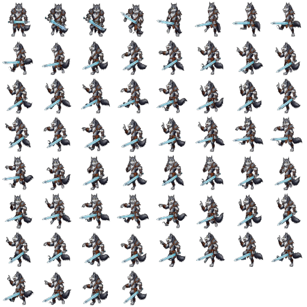

<div align="center">


<br/>

# 🔥 AETHORIA: Eternal Realms 🔥

### ⚔️ Custom MMORPG Engine • C++17 • SFML ⚔️

<p align="center">
  
  
  
</p>

---

### 🌑 Славянская мифология • 东方幻想 • Технологический СССР 🌑

</div>

---

## 🌍 Language / Язык

**🇷🇺 Русский** • [🇺🇸 English](#english)

---

# 🇷🇺 РУССКАЯ ВЕРСИЯ

---

## ⚔️ О ПРОЕКТЕ

**Aethoria: Eternal Realms** — это кастомный MMORPG-движок, созданный с нуля.

🔥 Без готовых решений
🔥 Полный контроль над системой
🔥 Своя архитектура + свой toolchain

Проект вдохновлён смесью:

* славянской мифологии
* восточной (китайской) эстетики
* индустриального духа СССР

---

## 🧠 ФИЛОСОФИЯ

```
DATA → JSON → ENGINE → WORLD
```

* данные управляют игрой
* логика отделена от контента
* редактор = часть движка

---

## 🎮 ДВИЖОК

### ⚔️ Core

* Реалтайм бой
* AI (FSM поведение)
* Entity system
* Scene system
* Эффекты и анимации
* Аудио система

---

### 🌍 Мир

* Тайловая карта
* NPC / враги / порталы
* JSON сцены
* Динамическая загрузка

---

### 🔥 Pipeline

* JSON-first архитектура
* Ассеты подгружаются автоматически
* Нет жёстко захардкоженных данных

---

## 🛠 РЕДАКТОР (Python)

### 🎨 Возможности

* Карта (рисование + flood fill)
* NPC / враги
* Префабы
* Квесты и диалоги
* Конфиги

---

### ⚡ Особенности

* Undo / Redo
* Быстрая итерация
* Прямая интеграция с движком

---

## 🎨 ВИЗУАЛЫ

### 🧍 Спрайты

<p align="center">
  
  
  
</p>

---

## 📦 ASSET SYSTEM

```
assets/
├── animations/
├── fonts/
├── maps/
├── music/
├── scenes/
├── sounds/
├── textures/
├── *.json
```

---

## 🏗 АРХИТЕКТУРА

```
ENGINE (C++)
├── Core
├── Scene
├── Entity
├── Animation
└── Audio

EDITOR (Python)
├── Map
├── Quests
├── Dialogues
└── Config
```

---

## 📁 СТРУКТУРА

```
project_root/
├── assets/
├── build/
├── docs/images/logo.png
├── editor/
├── saves/
├── src/
├── CMakeLists.txt
├── build.sh
└── README.md
```

---

## 🔨 СБОРКА

### 🐧 Linux / 🍎 macOS

```
./build.sh
```

---

### 🪟 Windows

```
build.bat
```

---

## ▶️ ЗАПУСК

```
./build/AETHORIA
```

---

## 🗺 РЕДАКТОР

```
python editor/aethoria_editor3.py
```

---

## 🔄 WORKFLOW

```
EDITOR → JSON → ENGINE
```

---

## 🚀 ROADMAP

### 🥇 Core

* Event System
* Skill System
* Item System

---

### 🥈 Multiplayer

* Server
* Sync
* Zones

---

### 🥉 MMO

* Accounts
* Database
* Persistence

---

### 🔥 Advanced

* Visual Scripting
* Behavior Trees
* World Streaming

---

## ⚡ СТАТУС

🟢 Активная разработка
🟡 Архитектура готова
🔴 MMO системы в процессе

---

---

# 🇺🇸 ENGLISH

---

## ⚔️ OVERVIEW

Custom MMORPG engine built from scratch.

---

## 🎮 FEATURES

* Real-time combat
* AI system
* Tile world
* Entity system
* JSON pipeline
* Integrated editor

---

## 🎨 VISUALS

<p align="center">
  
  
  
</p>

---

## 🔨 BUILD

```
./build.sh
```

or

```
build.bat
```

---

## ▶️ RUN

```
./build/AETHORIA
```

---

## 🗺 EDITOR

```
python editor/aethoria_editor3.py
```

---

## 📄 LICENSE

See LICENSE
