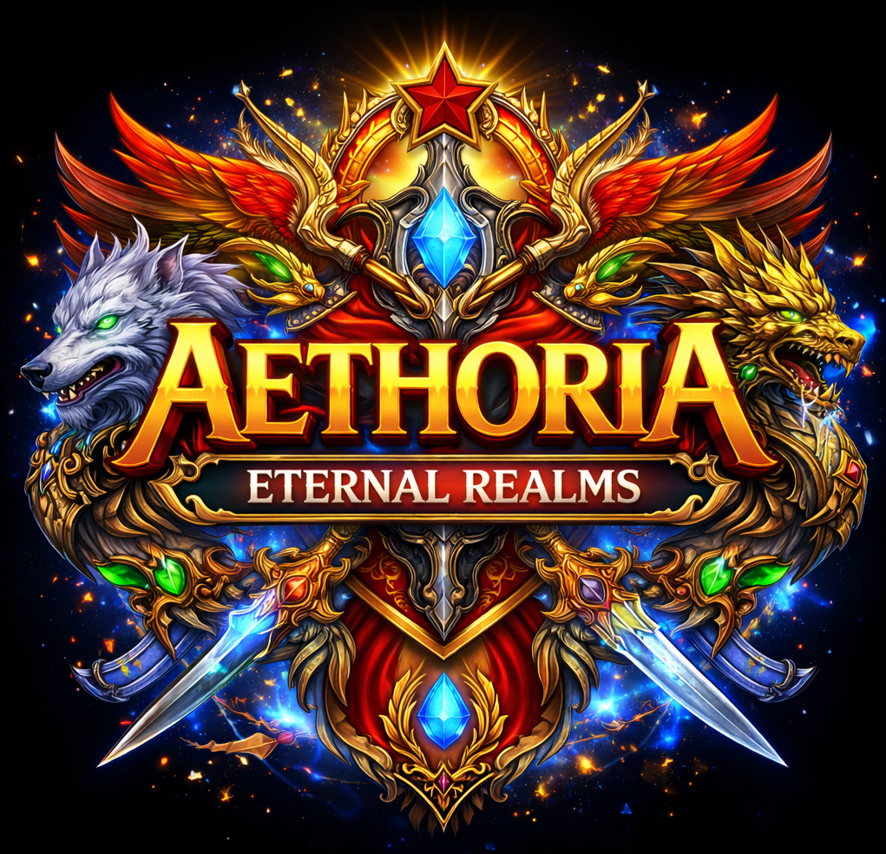

<div align="center">



# AETHORIA: Eternal Realms

**Custom MMORPG Engine (C++17 + SFML) with Integrated Python Editor**

<p align="center">
  
  
  
</p>

</div>

---

## 🌍 Language / Язык

**🇷🇺 Русский** | [🇺🇸 English](#english)

---

# 🇷🇺 Русская версия

## ✨ Обзор

**Aethoria: Eternal Realms** — это MMORPG-движок, написанный с нуля на C++17 с использованием SFML.

Проект построен вокруг:

* собственной архитектуры
* data-driven подхода (JSON)
* встроенного редактора

Без Unity и Unreal — полный контроль над системой.

---

## 🎮 Возможности

### ⚔ Движок

* Реалтайм боевая система
* AI (Idle → Patrol → Aggro → Combat)
* Тайловый мир
* Entity system (NPC, враги, порталы)
* Анимации (spritesheets)
* Аудио система
* Scene system
* JSON загрузка/сохранение
* Визуальные эффекты

---

### 🛠 Редактор (Python / Tkinter)

* Редактор карты
* Размещение NPC и врагов
* Префабы
* Квесты и диалоги
* Конфигурация
* Undo / Redo
* Автосинхронизация

---

## 🎨 Asset Pipeline

```id="aeth1"
assets/
├── animations/
├── fonts/
├── maps/
├── music/
├── scenes/
├── sounds/
├── textures/
├── dialogues.json
├── items.json
├── quests.json
├── prefabs.json
├── game_config.json
├── server_config.json
└── ui_config.json
```

* JSON-ориентированная система
* разделение данных и логики
* прямое использование движком

---

## 🏗 Архитектура

```id="aeth2"
ENGINE (C++)
├── Scene System
├── Entity System
├── Animation
├── Audio
└── Core

EDITOR (Python)
├── Map Editor
├── Quests
├── Dialogues
└── Config

DATA
└── JSON + Assets
```

---

## 📁 Структура проекта

```id="aeth3"
project_root/
├── assets/
├── build/
├── docs/
│   └── images/
│       └── logo.png
├── editor/
├── saves/
├── src/
├── CMakeLists.txt
├── build.sh
├── build.bat
└── README.md
```

---

## 🔨 Сборка

### 🐧 Linux / 🍎 macOS

```
./build.sh
```

Скрипт:

* проверяет зависимости
* собирает проект
* предлагает запуск

---

### 🪟 Windows

```
build.bat
```

---

## ⚙️ Особенности сборки

* используется CMake
* автоматически подключается SFML
* после сборки:

  * копируются `assets/`
  * копируются зависимости

Проект готов к запуску сразу.

---

## ▶️ Запуск

```
./build/AETHORIA
```

---

## 🗺 Редактор

```
python editor/aethoria_editor3.py
```

---

## 🔄 Workflow

```
Редактор → JSON → Движок
```

* изменения сохраняются мгновенно
* движок загружает напрямую

---

## 🎮 Управление

| Кнопка | Действие    |
| ------ | ----------- |
| WASD   | движение    |
| 1–4    | способности |

---

## 📦 Сохранения

```
saves/
```

---

## 🚀 Roadmap (кратко)

* Event System
* Skill Editor
* Item System
* Multiplayer
* Auth + Database
* Visual Scripting

---

---

# 🇺🇸 English

## ✨ Overview

**Aethoria: Eternal Realms** is a custom-built MMORPG engine written in C++17 using SFML.

Core ideas:

* custom architecture
* data-driven design (JSON)
* integrated editor

---

## 🎮 Features

### Engine

* Real-time combat
* AI system
* Tile-based world
* Entity system
* Animation system
* Audio system
* Scene system
* JSON save/load

---

### Editor

* Map editor
* NPC placement
* Prefabs
* Quests & dialogues
* Config editor
* Undo/Redo
* Auto-sync

---

## 🎨 Assets

```id="aeth4"
assets/
├── animations/
├── fonts/
├── maps/
├── music/
├── scenes/
├── sounds/
├── textures/
└── *.json
```

---

## 🔨 Build

### Linux / macOS

```
./build.sh
```

### Windows

```
build.bat
```

---

## ▶️ Run

```
./build/AETHORIA
```

---

## 🗺 Editor

```
python editor/aethoria_editor3.py
```

---

## 📄 License

See LICENSE file
